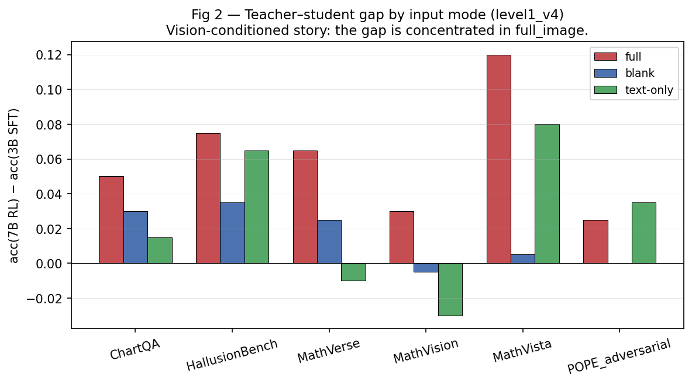

# Finding 2026-05-19 — Vision-Conditioned Capability Transfer in MLLM OPD

**Status**: post-audit, pre-training. Paper §1-2 seed.
**Canonical data**: `runs/audit/level1_v4_sysprompt_fixed/` (4 models × 3 modes × 6 benchmarks × 200 prompts).

---

## TL;DR

Vanilla on-policy distillation (OPD) supervises all generated tokens uniformly via dense KL against a teacher. For text-only LLMs that's defensible — every token in a long reasoning chain is potentially worth learning. For **MLLMs**, this audit shows it is not: the teacher's advantage over a smaller student is overwhelmingly **vision-conditioned**, while only a small fraction of teacher tokens actually carry vision-grounded signal. Most of vanilla OPD's per-token supervision therefore lands on language-prior tokens the student didn't need help with.

Two layers of evidence:

1. **Prompt-level.** Across 6 multimodal benchmarks (MathVista, MathVision, MathVerse, ChartQA, HallusionBench, POPE), among the **181 prompts where the RL teacher (MMR1-7B-RL) beats the SFT student (MMR1-3B-SFT)**, **133 (73%)** are *vision-critical* for the teacher — teacher gets it right with the image, wrong without (`full_image`=✓, `blank_image`=✗). 98 (54%) are even stricter: teacher also fails on `text_only`. On math/chart benchmarks the rate is **78-96%**. HallusionBench (42%) is a mixed counterexample where some of the teacher's advantage is language-prior.

2. **Token-level.** Forced-decoding the teacher's own completions on those 133 vision-critical prompts (96,159 tokens total) shows that **only ~7% of tokens have meaningful positive visual dependency** (vd > 0.5, where `vd(t) = logp(t | prefix, full_image) − logp(t | prefix, blank_image)`). Those tokens carry ~20% of the teacher's NLL "effort". The other 93% of tokens are language-prior (vd ≤ 0.5) and account for 55-75% of NLL effort.

The refined research question that follows directly from this:

> **Does vanilla OPD's dense token-level KL actually transfer the teacher's vision-conditioned capability, or is most of its supervision wasted on language-prior tokens?**

The cleanest test is the T1 OPD experiment described below: vanilla OPD with the teacher conditioning on the full image vs the blank image. If the visual signal matters, T1-FullTeacher should outperform T1-BlankTeacher on the 133 opd_target subset and on the vision-gap metric `G_gap`. If they're equivalent, vanilla OPD is not actually doing visual transfer at all.

---

## Setup and calibration

Four models, three input modes, six benchmarks, 200 prompts per benchmark = 24 cells × 6 = 24 paired analysis cells (each cell aggregated from 200 prompts; 1200 unique prompts total per pass).

| Model              | Role                       |
|--------------------|----------------------------|
| Qwen2.5-VL-7B-Instruct | Base (pre-post-training)   |
| MMR1-3B-SFT        | OPD student                |
| MMR1-7B-SFT        | Same-size pre-RL control   |
| MMR1-7B-RL         | OPD teacher                |

Modes: `full_image` (normal), `blank_image` (image replaced with same-size black canvas), `text_only` (image token dropped).

Benchmarks: MathVista (testmini), MathVision (testmini), MathVerse (testmini), ChartQA (test), HallusionBench (image split), POPE (adversarial).

**Calibration evidence.** Our `full_image` numbers reproduce the MMR1 paper (Table 2) at the model level after we (a) inject the verbatim training-time system prompt as a separate text block at the start of the user turn, (b) emit `<answer>...\boxed{X}...</answer>` extraction in the scorer, and (c) gate `tag_fallback` to high-confidence parse paths only:

| | Ours (level1_v4) | Paper Table 2 | Gap |
|---|---|---|---|
| Qwen2.5-VL-7B-Instruct MathVista | 0.685 | 0.693 | −0.8pt (n=200 noise) |
| MMR1-7B-RL MathVista | **0.720** | **0.720** | **0** (exact) |
| MMR1-7B-RL MathVision | 0.285 | 0.318 | −3.3pt |

This rules out trivial eval bugs as the explanation for downstream findings.

---

## Finding 1 (prompt-level): teacher's advantage is mostly vision-conditioned

The teacher's `full_image` accuracy beats the student by +6.8pt on average across the six benchmarks. Decomposed by input mode:

The gap is concentrated in `full_image` and disappears (sometimes inverts) in `blank_image` and `text_only` on math benchmarks. HallusionBench is the only benchmark where the `text_only` gap is comparable to the `full_image` gap (teacher's advantage there is partly language-prior).

Paired analysis (`scripts run: python -m mllmopd.analysis.paired_vision_critical`):

| Benchmark | Teacher_advantage | OPD_target | OPD_t / T_adv | PureV |
|---|---|---|---|---|
| ChartQA          | 28  | 27  | **96%** | 86% |
| MathVision       | 41  | 35  | **85%** | 68% |
| MathVerse        | 31  | 25  | **81%** | 61% |
| MathVista        | 36  | 28  | **78%** | 53% |
| HallusionBench   | 36  | 15  | 42%     | 14% |
| POPE_adversarial | 9   | 3   | 33%     | 33% |
| **TOTAL**        | 181 | 133 | **73%** | 54% |

Definitions:
- `Teacher_advantage`: prompts where teacher `full_image` is correct AND student `full_image` is wrong.
- `OPD_target`: subset of `Teacher_advantage` where the teacher is also vision-critical (teacher's `full_image`=✓, `blank_image`=✗).
- `PureV`: stricter subset where teacher also fails on `text_only`.

133 OPD-target prompt ids saved at `runs/audit/level1_v4_sysprompt_fixed/opd_target_ids.json`. These are the dev set for evaluating whether T1's OPD actually transfers the visual capability; they must NOT be used as training data.

---

## Finding 2 (token-level): teacher's visual signal is sparse

For each of the 133 OPD-target prompts, forced-decode the teacher's own generated completion under two image conditions: full and blank. The per-token signed `vd(t) = logp_full(t) − logp_blank(t)` measures the local visual dependency.

96,159 tokens bucketed by VD bin (`runs/audit/level1_v4_sysprompt_fixed/vd_summary.json`):

| VD bin | %tokens | %NLL mass | NLL/token |
|---|---|---|---|
| `very_low (vd ≤ -1)` | 0.6% | 24.7% | 6.37 |
| `low (-1 < vd ≤ 0)`  | 46.3% | 30.4% | 0.10 |
| `neutral (0 < vd ≤ 0.5)` | 46.3% | 24.9% | 0.085 |
| **`high (0.5 < vd ≤ 2)`** | **3.8%** | **12.1%** | 0.50 |
| **`very_high (vd > 2)`** | **3.0%** | **8.0%** | 0.42 |

Eyeball check on individual tokens confirms the bins: high-VD tokens are concrete vision-grounded nouns / numbers / object names (`'people'`, `'standing'`, `'5.03'`, axis labels); low-VD tokens are connectives, punctuation, and reasoning verbiage (`'the'`, `'\n'`, `'There'`, `'is'`).

If a vanilla OPD reward at a token position is roughly proportional to teacher's NLL effort there, then **~80% of vanilla OPD's supervision is allocated to language-prior tokens the student didn't need teacher help with**. The visual signal is dense in importance (high NLL/token at high-VD positions) but sparse in count (3-7% of positions).

The `very_low (vd ≤ -1)` row is interesting and not yet interpreted: 0.6% of tokens with 24.7% of NLL mass means a small set of high-stakes positions where image actively *hurts* the teacher's prediction. Spot-checks suggest these are answer-value tokens (e.g., the digits of the final boxed number in ChartQA) where both full and blank conditions place high probability mass but in slightly different distributions. We don't yet have a clean story for them — they should be analyzed before applying any positive-only VD weighting.

---

## Refined framing (paper §1)

> Vanilla MLLM OPD may fail to efficiently transfer the RL teacher's vision-conditioned capability. Its dense token-level KL spreads supervision uniformly across the response, but the teacher's visual signal is concentrated in a small subset of tokens (~7%) — and those happen to be the tokens the student most needs to learn. Most of the per-token supervision instead reinforces language priors that the student could predict on its own.

Two crisp claims that follow:

- **Prompt-level**: in multimodal reasoning, the RL teacher's advantage over its smaller student is conditional on visual input. (73% of advantage prompts are vision-critical.)
- **Token-level**: vanilla OPD's dense token supervision is misaligned with the location of the teacher's vision-grounded signal. (~7% of tokens carry ~20% of NLL effort; vanilla OPD spreads supervision over 100% of tokens.)

These are independent claims supported by independent metrics. Both can be reported separately and stand on their own.

---

## What this finding is NOT

- **NOT** "RL teachers have artifacts that OPD inherits." That was an earlier (now retracted) framing built on a buggy eval pipeline; at the correct prompt format the RL teacher is actually shorter and more accurate than 7B-SFT on math benchmarks.
- **NOT** "MMR1 RL is a regression." Same eval-bug retraction. See `project_mmr1_rl_regression.md` (memory).
- **NOT** a proposal of a new method. We have NOT trained anything yet. The framing is "this is what vanilla OPD looks like if you measure carefully; here is the experiment to verify the diagnosis."

The closest existing work is in the **RLVR direction** (sparse reward → dense via token reweighting). Both papers below define a per-token "visual dependency" and reweight advantages in PPO/GRPO; neither addresses KD / OPD / distillation.

- **PGPO** (Ye et al., arXiv:2604.01840) defines TVD as a **full-distribution KL**:
  `𝒮(s_t, I) := D_KL( π_θ(·|s_t, I) ∥ π_θ(·|s_t) )`,
  where the negative is constructed by **attention-masking visual tokens** (preserving positional indices). PGPO's algorithmic move is *token-level advantage reweighting*: per-token ω(I_t) is threshold-gated on normalized VD and renormalized to preserve sum.
- **VPPO** (Huang et al., arXiv:2510.09285, ICLR 2026 Poster) defines an analogous KL but with **stochastic patch-blackening** (14×14 patches independently set black with p=0.5) as the negative. Two-mechanism: trajectory advantage α(τ_i) scaled by mean trajectory VD, AND a top-40% token-level gradient mask.
- **PAPO** (Wang et al., arXiv:2507.06448) adds an Implicit Perception Loss as a KL term inside the RLVR objective — methodologically the closest cousin, but explicitly *not* teacher-based.

Our setting is **the orthogonal direction**: OPD's reward is already dense (per-token KL from a teacher), but its visual signal density is mismatched. The OPD-side intervention is to *re-allocate the dense supervision* toward high-VD tokens, not to *concentrate a sparse reward* up to the high-VD positions.

What we can defensibly claim as novel:
1. **First application of token visual dependency to KD / OPD.** Neither PGPO, VPPO, nor PAPO mentions distillation or teacher models. Their baselines are exclusively RL methods.
2. **Different negative construction.** Our `vd(t) = logp_full(t) − logp_blank(t)` is a *pointwise log-prob delta on the realized token under a blank image*, not a full-distribution KL. This is cheaper to compute on stored teacher completions and is exactly the right quantity for gating teacher *KL signal*, which is what dense OPD supervision is made of.
3. **Tighter sparsity number.** PGPO uses a threshold τ; VPPO operationalizes top-40%. We report **~7% of tokens carrying ~20% of NLL effort** on the vision-critical subset, using an explicit threshold (`vd > 0.5`) instead of a top-K cut. The exact methodology is published in `aggregate_vd.py`.

Risks to pre-empt in the paper:
- **VPPO's trajectory-level α(τ_i)** is conceptually transferable to OPD as a *trajectory-level KL weight*. We should include this as an ablation in T2 to claim our token-level move adds something beyond trajectory-level reweighting.
- **PAPO's KL-as-perception-loss** philosophy might be confused with ours. We should make explicit that PAPO targets RLVR reward shaping while we target OPD's token-level loss allocation.

Additional neighbors worth citing (perception-grounded RL / multimodal CoT lines):
- Perception-R1 (arXiv:2506.07218), PEARL (arXiv:2511.18437), VTPerception-R1 (arXiv:2509.24776), MMR1 (the teacher we audit), and the two adjacent token-reweighting works (2603.22847, 2603.25077).

---

## T1 design — testing the diagnosis

The framing is testable via a **negative control** that varies one knob:

| Arm | Setup |
|---|---|
| T1-0 | MMR1-3B-SFT no training (baseline) |
| T1-2 | Vanilla OPD; student rollout full image; teacher logp(token \| prefix, **full image**) |
| T1-3 | Vanilla OPD; student rollout full image; teacher logp(token \| prefix, **blank image**) |

Both arms share: student model, prompt pool, optimizer schedule, total token budget. The only diff: what image the teacher sees when scoring.

**Decision tree**:
- T1-2 ≫ T1-3 on math/chart + 133 opd_target + PureV → visual signal matters → framing holds, next is VD-aware OPD (T2)
- T1-2 ≈ T1-3 → vanilla OPD distills language priors regardless of teacher visual conditioning → also publishable but different paper
- T1-2 better full-acc but `G_gap` flat → visual transfer didn't happen, only language transfer did

**Eval metrics** (computed by extending existing audit infra):
- `G_full = Acc_T1^full − Acc_SFT^full`
- `G_gap = (full−blank)_T1 − (full−blank)_SFT`
- `blank_leakage = G_blank / G_full`
- `target_recovery` on the 133 opd_target subset
- `purev_recovery` on the 98 PureV subset

Training data: `MMR1-RL` ~15k QA pairs, first iteration on a 2-5k subset for cost. The 133 opd_target prompts are explicitly excluded from training to keep them as an honest dev set.

A separate planning agent is producing the concrete T1 implementation plan (Uni-OPD STUB reconciliation + per-token logging infra + eval pipeline + risk register). That plan lands in `docs/handoff-` or `docs/t1-plan-*.md`.

---

## References / data sources

- `runs/audit/level1_v4_sysprompt_fixed/summary.json` — aggregate cells
- `runs/audit/level1_v4_sysprompt_fixed/opd_target_ids.json` — 133 dev-set ids
- `runs/audit/level1_v4_sysprompt_fixed/T_RL_score_opd_target.jsonl` — per-token VD raw data
- `runs/audit/level1_v4_sysprompt_fixed/vd_summary.json` — binned token-level aggregate
- `runs/audit/level1_v4_sysprompt_fixed/figures/fig{1,2,3}.png` — visualization
- `src/mllmopd/analysis/paired_vision_critical.py` — prompt-level analyzer
- `src/mllmopd/analysis/aggregate_vd.py` — token-level analyzer
- MMR1 paper: arXiv 2509.21268 (Leng et al. 2025) — for calibration reference
- Memory: `project_hypotheses.md` (refined framing), `project_t1_design.md` (T1 layout), `project_mmr1_rl_regression.md` (retracted earlier finding)
