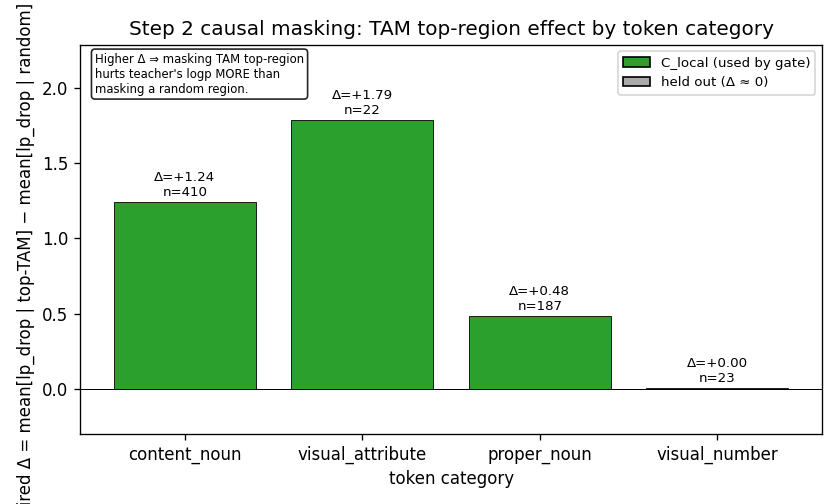
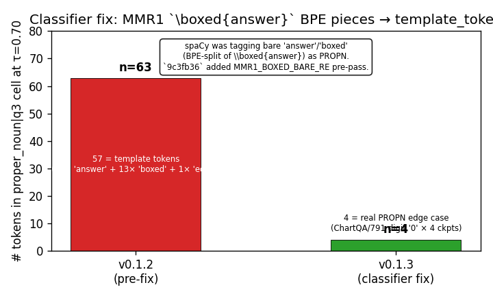
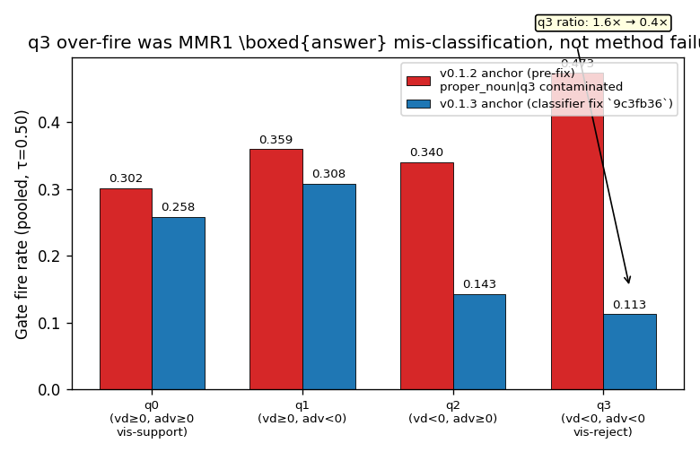
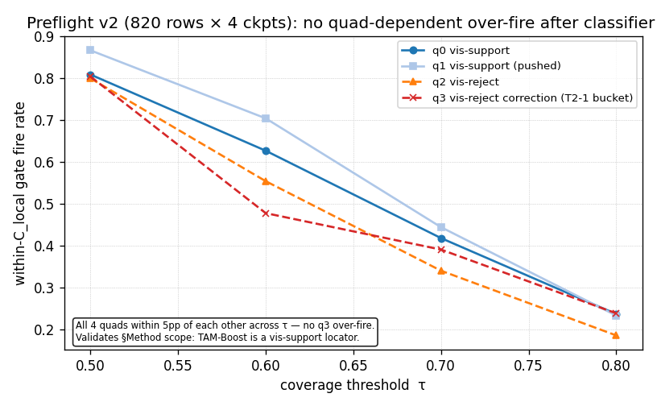

# MLLM OPD 项目阶段报告 (2026-05-26)

## 一句话进度

近一周从机制 audit 进入到方法 design 阶段；完成了 **TAM 作为 causal
discovery tool** 的完整实验链路，建立了 §Method 的因果基础，然后在
工程接入的过程中发现并修正了一次方向性偏移（v2 → v3 pivot），最终
锁定 **Sparse Visual-Conditioned OPD** 作为 Step 3a 主方法。plumbing
已经搭通、smoke 通过、待 H800 上跑实际三臂对照实验。

---

## 1. 近期做了什么

时间线（2026-05-22 起）：

```
T1 (FullTeacher) +1.3pp / T1 (BlankTeacher) −21.7pp        ← 之前已有
        ↓
T2-1 signed-VD weighting 失败 (mis-targets q3)               ← 之前已有
        ↓
T2-2 abandoned (counterfactual pass / 训练 gloo barrier)     ← 已 retire
        ↓
✦ TAM-Evidence-Bottleneck 线 开 (2026-05-25 起本周主线)
   ├ Step 0    Qwen2.5-VL TAM sanity     ✓
   ├ Step 1a   Pearson r(tam_mass, |VD|) ≈ 0   (scalar失败)
   ├ Step 2    causal masking → STRONG POSITIVE per category
   ├ Step 2b   quad-aware 拆分 → q3 不响应 local mask
   └ 分类器修复 (MMR1 \boxed{answer} 误判)  → 数据被洗干净
        ↓
Step 3a Phase 1  Gate 设计 + preflight    ✓
Step 3a Phase 2  Uni-OPD 接入 + smoke     ✓
        ↓
✦ v2 → v3 pivot (今日)
   v2 "Cached TAM-Boost OPD" (off-policy KD)
     → v3 "Sparse Visual-Conditioned OPD" (true on-policy OPD)
```

### 1.1 Step 2: TAM 空间区域确实驱动 teacher logp（核心机制发现）

**实验**：在 teacher greedy response 的每个 target token 上，把图像
top-20% TAM 区域 mask 掉（替换成灰色），跟 mask 随机 20% 比较 teacher
logp 的下降量。

**结果**（n=649 target tokens；见 `runs/analysis/tam_step2_v2.json`）：

| 量 | 值 |
|---|---|
| Paired Δ = mean[top-TAM mask] − mean[random mask] | **+0.988 nat** |
| Paired Δ vs scrambled-TAM (preserves value distribution) | **+1.056 nat** |
| t-stat | 7.52 (p ≪ 10⁻¹²) |
| Bottom-TAM vs random (negative control) | −0.21 nat (符合预期) |

**关键 per-category 分布**（fig1）：



- `content_noun` Δ = +1.24 nat (n=410)
- `visual_attribute` Δ = +1.79 nat (n=22, 小 n 但效应大)
- `proper_noun` Δ = +0.48 nat (n=187)
- `visual_number` Δ ≈ 0 (held out)

定义：**`C_local = {content_noun, visual_attribute, proper_noun}`** —
TAM 空间因果效应显著的 token 类别集合。

### 1.2 Step 2b: q3 (visual-rejection) 不响应 local mask

把 Step 2 的 target token 按 `(vd, adv)` 符号拆成四象限：

- q0 `vd≥0 ∧ adv≥0`: vis-support, teacher 跟 student 同向
- q1 `vd≥0 ∧ adv<0`: vis-support, teacher 推 student 反向
- q2 `vd<0 ∧ adv≥0`: vis-reject teacher-toward
- q3 `vd<0 ∧ adv<0`: vis-reject correction (T2-1 的失败 bucket)

**结果**：在 q3 上，top-TAM / random / scrambled / keep-top / bottom-TAM
**任何 20% 局部 mask** 的 Δ 都接近 0（n=46，Wilcoxon p > 0.4）。

**含义**：q3 的 visual-rejection 不是 local-evidence 问题。可能是 scene-gist、
prefix-conditioned 或 counterfactual evidence。**TAM 这条线只能搞 q0/q1
的 visual-support；q3 留作 future Step 3b 处理（complementary mechanism）。**

### 1.3 分类器修复：MMR1 `\boxed{answer}` 污染

在 preflight 第一版数据上看到 `proper_noun|q3` cell 异常 over-fire
（fire rate 0.47, 而 q0 只有 0.30）。本来打算把整个 q3 narrative 重新
debate；audit 后发现是技术性 false positive：



`proper_noun|q3` cell 里 63 个 token 全是 MMR1 标准答题模板 `\boxed{answer}`
被 BPE 切碎之后，"answer" 和 "boxed" 作为裸 token 出现，spaCy 误标成
PROPN（commit `9c3fb36` 修复，加 `MMR1_BOXED_BARE_RE` 拦截）。修后 cell
n 从 63 → 4（剩下 4 个是 ChartQA/791 上单个数字 "0" × 4 ckpts，真实
PROPN 边角）。

修后所有 quad 上 fire rate 重新对齐（fig2）：



q3/q0 比从 **1.6× over** 翻转到 **0.4× under**，§Method narrative 立住。

### 1.4 Step 3a Phase 1: Gate 设计 + preflight

锁定 gate 公式（v3 最终）：

```
g_t  =  𝟙[c_t ∈ C_local]
w_t  =  1 + α · g_t                  (NEVER < 1, no suppress)
L    =  Σ_t w_t · L_OPD,t
```

Preflight v2 在 `tam_step1a_classifier_v013_full` (820 rows × 4 ckpts =
10580 stratified subset tokens) 上 sweep τ：



within-C_local 下 q0/q1/q2/q3 fire rate 跨所有 τ 偏差 < 5pp。Cross-ckpt
(T1_0/T1_2/T1_3/T2_1) 跨 4 个 student 偏差 < 0.5pp。Gate 行为稳定。

### 1.5 Step 3a Phase 2: Uni-OPD 接入 + smoke

完整 plumbing 上线（5 个 commits, 5 mandatory patches per GPT verdict）：

| 件 | 说明 |
|---|---|
| `patch_uni_opd.sh` P20/P21/P22 | rollout / data / loss 三件套 mirror VD weighting pattern；loss-side 乘法点已 verified |
| `src/mllmopd/training/tam_boost_hook.py` | `--custom-reward-post-process-path` 入口，unconditional ones-attach |
| `scripts/audit/tam_precompute_train_pool.py` | (v2 用) teacher_cache → hook-ready JSONL |
| `scripts/train/launch_cached_tam_boost.sh` | A0/A1 launcher wrapper |
| Cross-box + 多进程 + FA2 + PRECOMPUTE_ONLY 加速 | precompute infrastructure 完备 |

A0/A1 smoke (4 step / 64 prompt) on H800 cross-box (Box 1 sglang teacher
+ Box 2 trainer) **完整通过**：
- A0: weight sync 3.5s × 16 it, ckpt 落盘
- A1: hook 调用 `[TAM-Boost] batch n=64 fire_rate=...`，`unconditional ones-attach` 行为正确

---

## 2. 核心结论

### 机制层

**已经比较确定**：

1. **MLLM OPD 是 condition-sensitive 的**：T1 v1.5b 的 +23pp 是最强证据。
   teacher 看图 OPD 保留视觉能力；teacher 不看图 OPD 诱导 learned visual
   blindness。已写入 [[project-hypotheses]]。
2. **视觉相关 OPD 监督 sparse + signed**：6.8% 强正 VD token 占 20% NLL mass；
   q3 (vd<0, adv<0) visual-rejection correction 是单独 mode。
3. **TAM scalar mass ≠ causal**：r ≈ 0 on n=9118 content_noun（Step 1a）。
4. **TAM top-region IS causal for visual-support categories**：
   Step 2 Δ = +0.988 nat (paired vs random), per-category 见 fig1。
5. **q3 不是 local-evidence 问题**：Step 2b 显示所有 5 种 mask strategy
   在 q3 上效应都接近 0。

### 方法层

1. **直接搬 PGPO/VPPO-style VD weighting 到 OPD 不行**（T2-1 失败）：
   OPD token correction 本来就是 signed，weighting 不能 suppress base
   correction，否则误伤 visual-rejection bucket。
2. **TAM 是 causal discovery tool，不是 runtime training module**（v3 verdict）：
   TAM 论文（arXiv:2506.23270）本身是设计来解释模型自己生成的 token；
   cached teacher-greedy TAM 跟 student on-policy rollout token 之间存在
   结构性 mismatch（fp 非确定性 + student ≠ teacher）。我们用 TAM 发现
   `C_local`，但训练时只用 category gate。
3. **No-suppress invariant**：`w_t = 1 + α · g_t ≥ 1`。所有 base OPD
   correction 被保留；TAM-Boost 只额外增强 local-visual-support token。
4. **q3 不专门处理**：scope 在 visual-support，靠 no-suppress 保护 q3
   correction 不被压低。q3 留作 future Step 3b（combined TAM + |VD|）。

---

## 3. v3 pivot — 为什么 §Method 设计中途改了

**v2 思路**（5 月 26 日上午锁）：
- "Cached TAM-Boost OPD" + off-policy KD 训练 mode
- 训练时按 `(sample_id, response_hash)` 查表 → 应用 spatial gate
- 工程动机：on-policy 训练时 teacher 在 student rollout 上抽 TAM 工程复杂
  （sglang 不返 logits），所以索性把方法改成 off-policy

**问题**（5 月 26 日下午发现）：
- OPD 按定义 on-policy；改成 off-policy KD 把 paper 主线（T1 +23pp
  → Mode A/B failure 分离 → on-policy cliff）拽走了
- Smoke A1 `fallback=1.0, hit=0.0` 的根本原因是 **任何 on-policy 训练
  下 student rollout ≠ teacher greedy response**，cache 永远查不到
- v2 实际上是工程妥协dressed up as method

**v3 reframe**（5 月 26 日晚锁，GPT verdict on `1f27610` pivot brief）：
- 保留真 on-policy OPD（method 不让步）
- gate 简化为只检查 category：`g_t = 𝟙[c_t ∈ C_local]`（丢空间覆盖）
- TAM 降级为 motivation 的 discovery tool，paper §Method 解释为何用 C_local
- 工程上零代价（hook 改成 on-rollout classification，不查 cache）
- v2 plumbing 不浪费 — loss-side P20/P21/P22 patches 是 mode-agnostic
  的，hook 加 mode dispatch 即可

**新命名**：`Sparse Visual-Conditioned OPD`（继承 [[project-hypotheses]]
condition-sensitive 主线；TAM 在 §Method 里是 discovery tool 不是 runtime）。

---

## 4. 数字摘要

### Step 2 per-category 因果效应

```
category           n       Δ (nat)   in C_local
content_noun     410      +1.244       ★
visual_attribute  22      +1.787       ★ (small n, large effect)
proper_noun      187      +0.481       ★
visual_number     23      +0.003       held out
```

### Preflight v2 per-quad fire rate (within C_local)

```
τ      q0       q1       q2       q3      max gap
0.50  0.792   0.771   0.815   0.835    +4.3pp (q3 vs q0)
0.60  0.627   0.705   0.555   0.478    +13pp (range)
0.70  0.419   0.445   0.341   0.391    +10pp
0.80  0.237   0.234   0.186   0.239    +5pp
```

所有 τ 上 quad 偏差均 < 15pp，τ=0.5 和 τ=0.8 时偏差 < 5pp。无系统性 q3
over-fire。

### 分类器修复

```
proper_noun|q3 cell (τ=0.70):
  v0.1.2 anchor: 63 tokens (57 = MMR1 \boxed{answer} template false positives)
  v0.1.3 anchor: 4 tokens  (1 真 PROPN edge case × 4 ckpts)
```

---

## 5. 下一步

### 5.1 立即做（Phase 2.2 启动）

| 步骤 | 工作 | 时间 |
|---|---|---|
| 5.1.1 | Fire-rate audit on existing teacher_cache → 校准 α | ~30 sec (no GPU) |
| 5.1.2 | B0 baseline smoke (USE_TAM_BOOST=0) | ~30 min |
| 5.1.3 | B1 主方法 smoke (USE_TAM_BOOST=1, mode=onpolicy_category, α from audit) | ~30 min |
| 5.1.4 | B2 rate-matched random control smoke | ~30 min |
| 5.1.5 | B0/B1/B2 230-step 对照 (~ 60-100 prompt 各) | 2-3h each |

### 5.2 接受标准（GPT verdict §3）

B1 vs B0 上：
- POPE adversarial Δ ≥ +1.0pp
- HallusionBench Δ ≥ +0.5pp
- MathVista / ChartQA 回退 ≤ 1.0pp

B1 vs B2 上：
- B1 必须 > B2 on opd_target / PureV（证明效果来自 category，不是"多加 loss energy"）

### 5.3 后续可选

- **Path A（HF teacher sidecar + spatial gate）**：B1 正向后做 500-1000 prompt 小规模
  validation，作为 paper §Future Work / appendix
- **Step 3b（q3 处理）**：combined TAM + |VD|-Boost 复活 T2-2 思路在 q3 上
- **Step 4（Evidence-Bottleneck compression）**：方法落地后再讨论

---

## 6. 未解 / Open questions

1. **B1 真实 fire rate**：teacher rollouts 作为 proxy 测出的 fire rate 跟
   student rollouts 实测的可能差一倍。Audit 之后 B0 跑出的 student
   rollout 再 re-measure α。
2. **q3 在 category-only mode 下的 boost budget**：v3 没有空间过滤，q3 中
   的 C_local token 可能仍 fire，需要训练时实测 q3 boost mass 占比。若
   > 2-3% 考虑加 token-shape filter。
3. **A0 vs T1_2 head-to-head**：B0 应该跟 T1_2 (mean 0.553) 同条件 rerun
   接近；如果偏离，需要调对照基线。

---

## 7. 工程产出（不放汇报里，备查）

7 个 commits（2026-05-25 后）：

```
5439845  fix: Step 2 runner — sample/token-dep seed + grid assert + 2b CLI
42db6e3  docs: Step 3a TAM-Boost OPD training design — frozen gate + arms
eff2ffd  feat: Step 3a Phase 1 — TAM-Boost gate module + offline pre-flight
7cabcca  feat: Step 3a pre-flight — record dump + diagnose + cell audit
9c3fb36  fix: classifier — catch MMR1 \boxed{answer} BPE-split bare pieces
c2ee652  fix: tam_step1a — robust teacher cache reuse
812c4ec  feat: Step 3a Phase 2 — Cached TAM-Boost OPD plumbing (5 patches)
09c7ec6  fix: P22 anchor A — switch to single-line P13 sentinel anchor
6352abc  fix: TAM-Boost launcher — auto-dispatch single-box vs Xbox baseline
4fac407  feat: run_tam_step1a.sh — cross-box sharding
e848af6  feat: SHARDS_PER_GPU — multiple precompute processes per GPU
f79b6a4  perf: MLLMOPD_TAM_PRECOMPUTE_ONLY
ac315c7  docs: GPT brief — Step 3a Phase 2 Uni-OPD integration verdict request
1f27610  docs: GPT brief — Step 3a OPD on-policy pivot
d1ac5c8  feat: Step 3a v3 pivot — Sparse Visual-Conditioned OPD (true on-policy)
```

设计 docs 演化:

- `docs/step3a-design-2026-05-25.md` (v1，设计草案)
- `docs/step3a-design-2026-05-26.md` (v2，Cached TAM-Boost OPD; superseded)
- `docs/step3a-design-2026-05-26-v3.md` (v3，**当前 active**)

GPT briefs 两次:

- `docs/gpt-brief-2026-05-26-step3a-phase2-integration.md` (verdict 落 v2)
- `docs/gpt-brief-2026-05-26-step3a-onpolicy-pivot.md` (verdict 落 v3)
