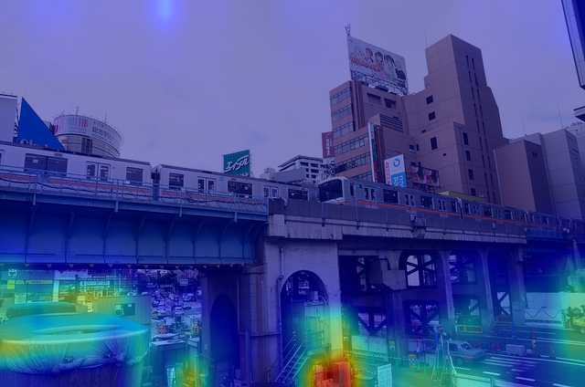
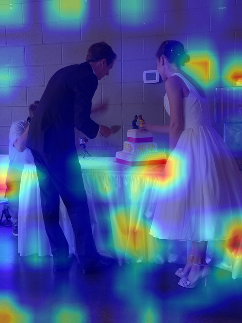
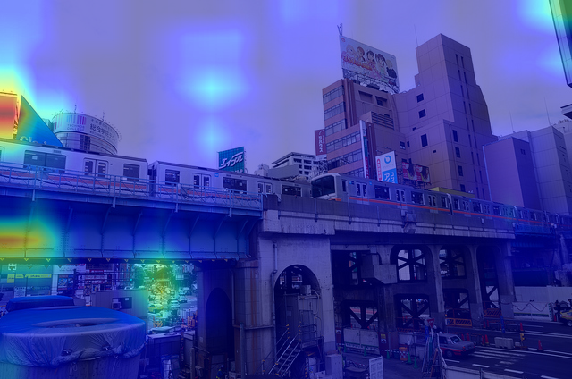
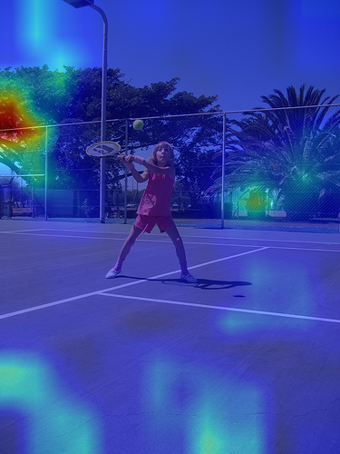
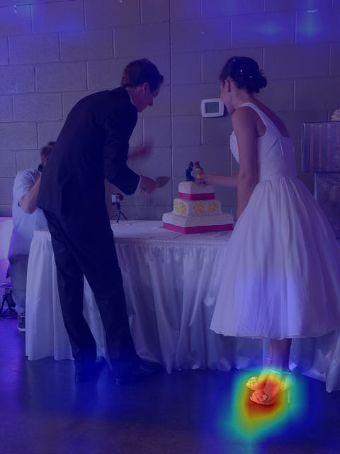

# Step 0 TAM Sanity Check — Results (2026-05-25)

## TL;DR — VERDICT: PASS with caveats

TAM produces nonzero, interpretable signal on Qwen2.5-VL (MMR1-3B-SFT teacher),
but **signal quality varies dramatically by token type**:

- **Content nouns** (e.g. "trash") localize cleanly on the right region
- **Answer / template tokens** (e.g. `<answer>Yes`, `<|im_end|>`, `:**`) localize noisily
  and can be pulled by saliency (e.g. the most-salient object in the scene)
- **Pronouns** (e.g. "He") localize unreliably

→ **Greenlight Step 1 calibration**, but with a Step 1 strata refinement: must
explicitly stratify by token POS / category so the calibration controls for
"clean content noun" vs "noisy template / pronoun / saliency-pulled".

## Run metadata

| Field | Value |
|---|---|
| Code commit | `79f8e89` (`feat: offline TAM overlay renderer`) |
| Model | `MMR1/MMR1-3B-SFT` (Qwen2.5-VL family) |
| Box | H800 single GPU |
| Probes | 4 (3 POPE_adversarial Yes/No + 1 caption variant of POPE/1636) |
| Run dir | `runs/audit/tam_sanity_20260525-133802/` (H800; pulled to Mac at same path) |
| Wall-time (generate + TAM) | ~3-5 min for 4 probes |
| `tam_valid` | `true` on all 4 probes |

## The 6 critical overlays

All 6 PNGs are committed under `docs/figures/step0/` for permanent reference
(also so reviewers can fetch them via raw repo URLs).

### A. Content-noun token = clean signal ★

`car_trash_contentnoun.png` — for POPE/2710 (Tokyo urban scene; train on
elevated tracks dominates upper-left, street with cars/trash-can-like objects
in lower portion). The model's CoT says: *"Crop 5 (bottom left) shows a blue
object which might be a trash can or similar structure."* TAM for the token
**"trash"** localizes precisely on **the lower-left blue object**.
**This is the strongest single piece of evidence that TAM is wired up correctly
on Qwen2.5-VL.**



### B. Answer-span token in vision-favorable case = plausible signal

`knife_answer_Yes.png` — POPE/90 (wedding cake-cutting scene; man on left,
bride on right, cake in middle). TAM for `<answer>Yes` heat concentrates on
the **lower-center (cake + cake-cutting hands area)** — the action region.
Not specifically on a knife blade, but in the right semantic neighborhood.



### C. Answer-span token, salient-distractor failure ✗

`car_answer_Yes.png` — same POPE/2710 scene. TAM for `<answer>Yes` heat is
**on the elevated train track on the LEFT**, NOT on the street-level cars
(lower-right) which is what the model's CoT correctly identified. The heat is
on the most-salient object (the train), not the asked-about object (the cars).
**This is the strongest evidence TAM has a saliency-pull failure mode on
non-content tokens.**



### D. Answer-span, mixed signal

`racket_answer_Yes.png` — POPE/1636 (girl on green tennis court, racket raised
in upper area). TAM for `<answer>Yes`: some activation in upper-right (near
racket location ✓) but strong simultaneous activation on upper-left sky/trees
and on court lines. Not clean.



### E. Pronoun = noisy

`knife_He_pronoun.png` — POPE/90. TAM for the token **"He"** (referring to the
man cutting the cake) localizes on the **floor beneath the bride's feet**, not
on the man. Pronoun referent resolution does not show through TAM.



### F. Meta-token (no clean ground truth)

`car_Crop_metatoken.png` — the token "Crop" in the model's CoT
("Crop 5 (bottom left)...") references the model's own internal image crops
rather than a scene object. TAM heat is scattered across the top area — no
clean expected GT. Noted only to show TAM doesn't *catastrophically* fail on
such tokens; it just doesn't carry meaningful signal.


## Mechanism interpretation

### Why `tam_mass_top20` top-K-by-token is misleading

`summary.txt` ranks top-5 tokens per probe by `tam_mass_top20`, the
top-20%-mass concentration ratio. All four probes have top-5 dominated by
`<answer>`, `<think>`, `:**`, `<|im_end|>` with `tam_mass_top20 ≈ 0.9–1.0`.
But these are *the worst tokens* for visual-grounding interpretation.

**Why**: `tam_mass_top20` measures *concentration*, not *correctness*. Rare
chat-template tokens have lm_head channels that happen to be sharply peaked at
SOMEWHERE on the image patch grid, regardless of where that peak is. ECI
(estimated causal inference) subtracts redundancy from *non-repeating
preceding tokens* — chat-template tokens appear at most twice in a response,
so ECI doesn't remove their idiosyncratic concentration.

Content nouns ("trash", "racket", "knife") have less peaky lm_head channels
but their peaks land on referent regions. So they have LOWER `tam_mass_top20`
but HIGHER correctness.

### The four observed token regimes

| Token type | TAM signal quality | Why |
|---|---|---|
| Content nouns (referent in image) | Clean (e.g. "trash" → blue object) | lm_head channel has spatial structure tied to referent |
| Answer-span / template tokens | Noisy, saliency-pulled | Logp determined by CoT context, lm_head spatial pattern unstructured |
| Pronouns | Noisy / random | Referent resolution doesn't reflect in lm_head spatial pattern |
| CoT-meta tokens | Scattered | No grounded referent |

### What this means for Step 1

The calibration question is: **does `tam_mass` correlate with `|vd|`?** The
above suggests the answer should be **conditional on token type**:

- On content nouns: high `tam_mass` ↔ high `|vd|` (both signal "vision-meaningful")
- On template/pronoun: `tam_mass` is noise; `|vd|` should also be low ⇒ both near zero, low spurious correlation
- On answer-span tokens: open question — `|vd|` *could* be nontrivial (the model is committing to an answer that depends on visual evidence) but TAM's lm_head spatial pattern for `Yes` is decoupled from visual grounding

**Saliency-pull on car-probe answer_Yes is a real Step 1 confound**. We should
test whether saliency (e.g. attention rollout / attention entropy) is itself a
better predictor than TAM on these tokens.

## Proposed Step 1 schema additions (toward v0.1.2)

| New field | Type | Purpose |
|---|---|---|
| `is_content_noun` | `bool × R` | POS-tag-based (use spaCy or NLTK on response_text + token-span align) |
| `pos_tag` | `str × R` | Full POS tag for finer slicing |
| `is_template_token` | `bool × R` | Matches `<answer>`, `<think>`, `:**`, `<|im_end|>` etc. (regex on token text) |
| `attention_baseline_mass_top20` | `float × R` | Optional: attention-rollout heatmap mass_top20 as a non-TAM baseline. If attention-rollout = TAM on these tokens, TAM adds nothing. |

(Field-naming and storage stay forward-compatible with the v0.1.1 row.)

## Proposed analyzer-side additions

```
"per_ckpt_per_source": {
  "T1_0_base@teacher_greedy": {
    ...
    "corr_tam_mass_abs_vd_by_token_type": {
      "content_noun": float, "template_token": float,
      "answer_token": float, "pronoun": float, "other": float
    },
    "auc_high_abs_vd_by_token_type": {...},
    "ap_visual_rejection_by_token_type": {...},
    "saliency_baseline_correlation": float,   // does attention-rollout beat TAM?
    ...
  }
}
```

## Questions for GPT

1. **Is the "content noun clean / template token noisy" finding consistent with
   TAM's paper claims?** Paper says ECI removes context interference; in practice
   we observe ECI doesn't help template tokens (their context-interference is
   small because they don't repeat). Is this expected, a misuse, or a real
   limitation worth flagging in the paper?

2. **Is the saliency-pull failure (car-probe answer_Yes → train) a fatal flaw
   for the method-tier port, or a normal MLLM-explanation failure mode that
   doesn't break TAM-vs-VD calibration?** I lean toward "doesn't break Step 1"
   because VD is also unreliable on `<answer>Yes`-type tokens, so the two
   should agree on low-signal tokens too. Confirm or push back?

3. **Should Step 1 strata explicitly add a POS-tag-based `is_content_noun`
   stratum?** I think yes, but want a sanity check on POS-tagger choice
   (spaCy / NLTK / model-based) given chat-template tokens are unusual.

4. **Should we add `attention_baseline_mass_top20` as a non-TAM baseline?**
   If attention-rollout produces the same heatmap on these tokens, TAM's ECI
   adds nothing and the one-forward replacement claim is weaker. Adding this
   doubles compute slightly but is one of the most informative controls.

5. **Should the "TAM works on content nouns, noisy elsewhere" be the headline
   Step 1 finding, OR should we treat it as a confound to clean up before
   reporting?** This affects paper framing. The honest version is more
   defensible but harder to write into "TAM is a one-forward VD replacement".

6. **The pronoun failure ("He" → bride's feet) is a known referent-resolution
   issue in attribution methods. Does it bear on our paper, or is it a
   side observation we should park?**

7. **Forward-compat with Step 2 causal masking**: if Step 1 confirms TAM-VD
   correlation is high on content nouns, will Step 2 mask/drop experiments on
   *content nouns* be sufficient to validate causality, or do we also need
   answer-span causal masking even though TAM is noisy there?

## Out of scope (do not redo)

- Direction (TAM as diagnostic vs method, compression framing) is settled.
- Schema v0.1.1 structural decisions are settled (`response_source`,
  `token_uid`, `tam_mass_top{10,20,40}`, etc.). Only POS-tag and attention
  baseline are *additions*, not revisions.
- 5-stage plan (Step 0 → 1a/1b → 2 → 3 → 4) is settled.

## Response format I'd like

- **Q1–Q7 verdicts**: agree / refine / block, with one-line reasoning
- **Schema v0.1.2 additions**: which to add, which to drop
- **One paragraph**: greenlight writing Step 1 code on commit `79f8e89` + schema v0.1.2 patch, or block?

**请用中文回复。**
